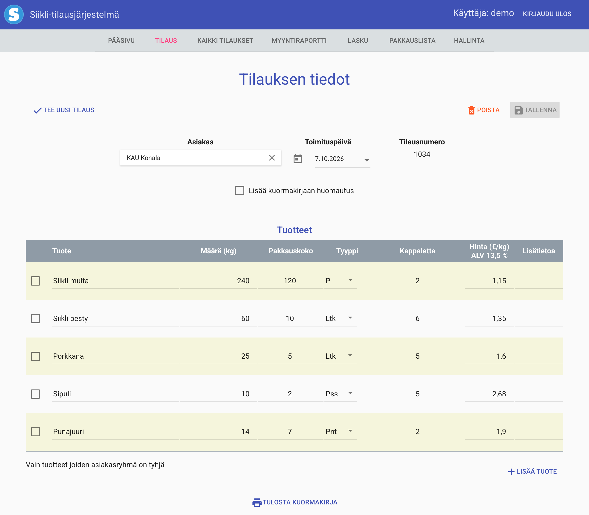

# Siikli

Siikli is an order, invoicing and packing-list system for wholesale food
deliveries. It has been in daily use for nine years, with **€17 million**
invoiced through it. I built it, and I have run and maintained it the whole
time.



*The order screen, with demo data. The app is in Finnish.*

## What it does

- **Orders:** one order per customer and delivery date. Prices come from the
  product list and can be changed per order.
- **Packing lists:** what the warehouse packs for a day, by product or by
  customer, with a waybill for each delivery.
- **Invoices:** a customer's deliveries for any period as one invoice, with VAT
  and a list of every delivery.
- **Sales reports:** every sale in a period as an Excel file.
- **Two roles:** the office sees everything. The warehouse sees only the
  packing lists, without prices, and the server checks this on every request.

## The 2026 upgrade

By 2026 Siikli still ran on Java 8 and Spring Boot 1.4, on a server set up by
hand. I upgraded it with one rule: no invoice, report or saved order may change.

The checks came first, before any code changed:

- The jar was rebuilt from the repository on Java 8 and compared with the jar
  in production. The classes and libraries were the same, byte for byte, so the
  repository had the code that runs in production.
- That build runs in Docker with a copy of the data. Its output is the baseline.
- A comparison runs every invoice, packing list and sales report since 2017
  against the old and the new version. That is about 73,800 requests, compared
  value by value, and the Excel files cell by cell.
- 83 Playwright tests cover the save actions, the roles and the reports.

Both passed on the old version first. Then came the upgrade:

- Java 21 and Spring Boot 4.1.
- A new login with Spring Security.
- AngularJS updated in place. A small npm build script replaced Grunt and Sass,
  and its output is the same as the old build, byte for byte apart from the
  build time.
- A new server built from scripts, with HTTPS, a firewall, automatic security
  updates, monitoring, and hourly encrypted backups that can't be deleted early.

The checks found about a dozen breaking changes in the frameworks, and most of
them were silent. Hibernate would have changed a date column's type on the first
start. New ids would have collided with old ones, and some report rows would
have disappeared. All of them were fixed before the release, and the final
comparison found no differences in values.

## How I used AI

I did the upgrade with Claude Code, using Claude Opus 5.5 at its xhigh effort
setting. It wrote most of the code, tests and server scripts. I set the rules,
reviewed the changes and made the decisions.

What did I tell it, beyond "fix it and make no mistakes"? Honestly, not much.
The model works very well, and many of the best ideas were its own. Once it had
added the tests, it broke the code on purpose to check that they would catch a
real bug: a change in how invoices round gave a one-cent difference on two
invoices, and the comparison caught it. It also decided to compare the old and
the new versions byte by byte, down to the database, and that found real
mistakes. It was smarter about this than I was.

The decisions that were mine:

- Tests first, then the upgrade. Siikli had a few browser tests from 2017. The
  agent had to add 83 Playwright tests and the comparison of every invoice and
  report, and get them passing on the old version, before it could change
  anything.
- The cheapest server that does the job: a DigitalOcean droplet with 1 vCPU and
  2 GB of RAM.
- Backups that no one can delete early, not even me: S3 Object Lock in
  compliance mode.
- Keep AngularJS 1. It is old and outdated, but it does the job, and the users
  don't want changes. A rewrite would have been the riskiest change for the
  least value.
- Keep the look from 2017. A polished new UI would have been easy to make. I
  think people now prefer something real, with a few rough edges, to polished
  fluff.
- The landing page and the app at separate addresses, so the landing page can be
  public and the app stays for its users.

I planned four weekends for the upgrade, and the code and tests took one day.
Speed was not the hard part. Knowing the result was right was.

## This repository

This repository holds the landing page at [siikli.fi](https://siikli.fi). The
app itself is in a private repository. The page is plain HTML and CSS with no
build step, published with GitHub Pages from `main`. All screenshots use demo
data.

To preview it locally:

```sh
python3 -m http.server 8090 --bind 127.0.0.1
```

Then open http://127.0.0.1:8090.
